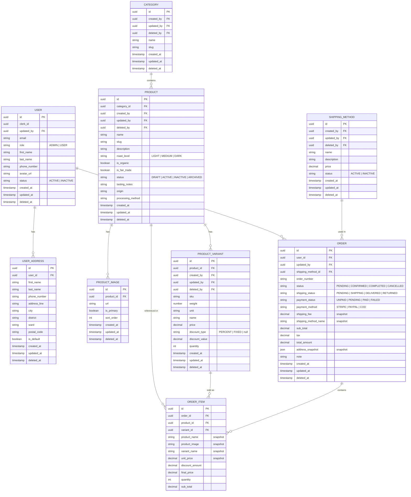

# Node.js E-commerce API Practice

## OVERVIEW

Practice API for a coffee-shop style domain (users, categories, products, orders) with Express, TypeScript, Clerk, and TypeORM.

## TIMELINE

- Estimated time: 10 days
- Actual time: 10 days

## TECHNICAL STACK

- **[Node.js](https://nodejs.org/en/docs)** v20.x
- **[TypeScript](https://www.typescriptlang.org/docs/)** v5.9.x
- **[Express.js](https://expressjs.com/)** v5.2.x
- **[Clerk](https://clerk.com/docs/references/express/overview)** (`@clerk/express` v2.x)
- **[PostgreSQL](https://www.postgresql.org/docs/)** v18.x
- **[TypeORM](https://typeorm.io/)** v0.3.x & **[reflect-metadata](https://github.com/rbuckton/reflect-metadata)** v0.2.x
- **[Winston](https://github.com/winstonjs/winston#readme)** v3.19.x
- **[Zod](https://zod.dev/)** v4.x
- **[Helmet](https://helmetjs.github.io/)** v8.x & **[cors](https://github.com/expressjs/cors)** v2.x
- **[Svix](https://docs.svix.com/)** v1.x
- **[Swagger](https://swagger.io/docs/)** (**[swagger-jsdoc](https://github.com/Surnet/swagger-jsdoc)** v6.x & **[swagger-ui-express](https://github.com/scottie1984/swagger-ui-express)** v5.x)
- **[Jest](https://jestjs.io/docs/getting-started)** v29.x & **[Supertest](https://github.com/ladjs/supertest#readme)** v7.x
- **[ESLint](https://eslint.org/docs/latest/)** v9.x, **[Prettier](https://prettier.io/docs/en/)** v3.x, **[Husky](https://typicode.github.io/husky/)** v9.x

## SYSTEM REQUIREMENTS

- **[Node.js](https://nodejs.org/)** v20.x
- **[pnpm](https://pnpm.io/)** v7.32.x

## TARGETS

- Design a relational database schema.
- Produce a backend architecture document and API design.
- Use **[Clerk](https://clerk.com/docs/references/express/overview)** for authentication in Node.js.
- Implement a **RESTful API** with [Express.js](https://expressjs.com/) and [TypeScript](https://www.typescriptlang.org/docs/).
- Configure database connectivity and ORM/Query Builder interactions.
- Handle errors with **centralized error handling**.
- Generate API documentation with **[Swagger](https://swagger.io/docs/)**.
- Validate request and response data (e.g. **[Zod](https://zod.dev/)**).
- Write **unit and integration tests** with **[Jest](https://jestjs.io/docs/getting-started)** and **[Supertest](https://github.com/ladjs/supertest#readme)**.

## Features

- User authentication & JWT-based access
- User can place orders
- Admin can CRUD operations on Products
- Admin can edit order status
- Centralized error handling
- Request/response validation

## Entity Relationship Diagram (ERD)

---

## API ENDPOINTS

> Base path: `/api/v1`
> API docs `/api/api-docs`.
>
> **Auth:** 🔓 Public · 🔒 Authenticated (Clerk JWT) · 👑 Admin

### Users

| Method   | Path         | Auth | Description                    |
| :------- | :----------- | :--- | :----------------------------- |
| `GET`    | `/me`        | 🔒   | Get authenticated user profile |
| `GET`    | `/users`     | 👑   | List all users                 |
| `GET`    | `/users/:id` | 👑   | Get user by ID                 |
| `POST`   | `/users`     | 👑   | Create user                    |
| `PATCH`  | `/users/:id` | 👑   | Update user                    |
| `DELETE` | `/users/:id` | 👑   | Soft-delete user               |

### Categories

| Method   | Path              | Auth | Description          |
| :------- | :---------------- | :--- | :------------------- |
| `GET`    | `/categories`     | 🔓   | List categories      |
| `GET`    | `/categories/:id` | 🔓   | Get category by ID   |
| `POST`   | `/categories`     | 👑   | Create category      |
| `PATCH`  | `/categories/:id` | 👑   | Update category      |
| `DELETE` | `/categories/:id` | 👑   | Soft-delete category |

### Products

| Method   | Path            | Auth | Description                                                    |
| :------- | :-------------- | :--- | :------------------------------------------------------------- |
| `GET`    | `/products`     | 🔓   | List products (filter by status, category, roast level, price) |
| `GET`    | `/products/:id` | 🔓   | Get product by ID                                              |
| `POST`   | `/products`     | 👑   | Create product                                                 |
| `PATCH`  | `/products/:id` | 👑   | Update product                                                 |
| `DELETE` | `/products/:id` | 👑   | Soft-delete product                                            |

### Orders

| Method   | Path                          | Auth | Description                           |
| :------- | :---------------------------- | :--- | :------------------------------------ |
| `GET`    | `/orders`                     | 🔒   | List orders                           |
| `GET`    | `/orders/:id`                 | 🔒   | Get order by ID                       |
| `POST`   | `/orders`                     | 🔒   | Place order                           |
| `PATCH`  | `/orders/:id/status`          | 👑   | Update order status                   |
| `PATCH`  | `/orders/:id/shipping-status` | 👑   | Update shipping status                |
| `DELETE` | `/orders/:id`                 | 👑   | Delete order (pending/cancelled only) |

---

## GETTING STARTED

| Command                                                                 | Action                 |
| :---------------------------------------------------------------------- | :--------------------- |
| `git clone git@gitlab.asoft-python.com:tien.nguyen/nodejs-training.git` | Clone repository       |
| `cd nodejs-training/coffee-shop-api`                                    | Open coffee-shop-api   |
| `pnpm install`                                                          | Install dependencies   |
| `pnpm dev`                                                              | Run dev server (watch) |
| `pnpm build`                                                            | Compile to `dist/`     |
| `pnpm start`                                                            | Run compiled app       |
| `pnpm test`                                                             | Run tests              |
| `pnpm test:coverage`                                                    | Tests with coverage    |
| `pnpm lint` / `pnpm format`                                             | Lint and format        |

For Clerk, database, and other secrets, use `.env` (see `.env.example`). For environment variable details, email **tien.nguyen@asnet.com.vn**.
